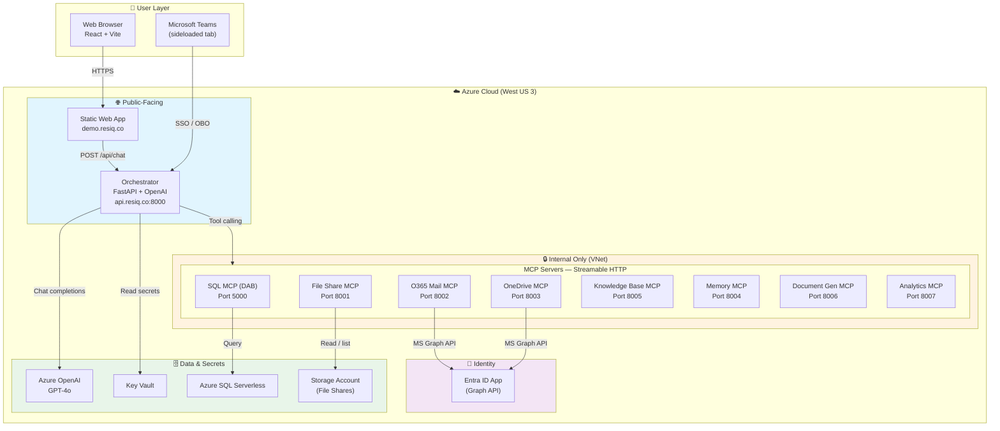
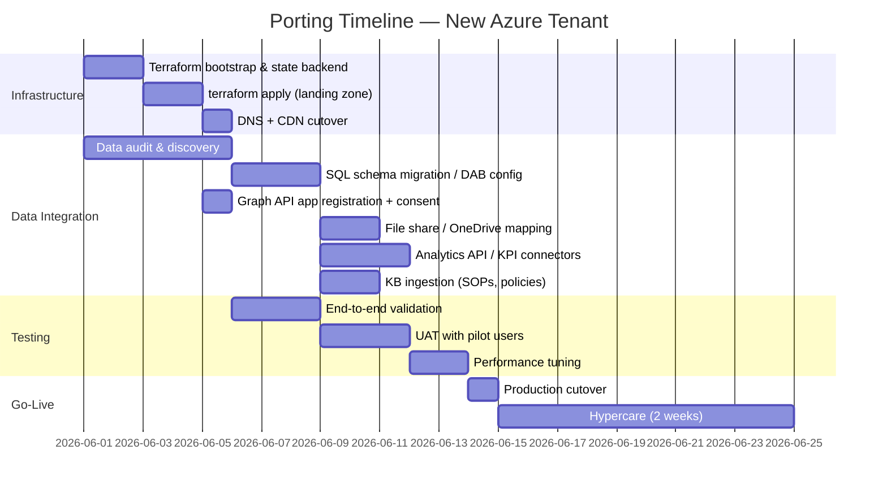

# AI Agentic Q&A — Architecture Overview

> High-level design document for the ResiQ AI Agentic Q&A platform.  
> **Last updated:** May 6, 2026  
> **Status:** Deployed & operational on Azure (`rg-aiagent2-dev`)

---

## 1. What Is This?

ResiQ is an **AI-powered agentic question-and-answer platform** that lets users ask natural-language questions about data scattered across their organization — emails, files, databases, OneDrive, SOPs, and analytics dashboards. Instead of manually searching five different systems, a user types one message into a chat UI; the system reasons over the request, calls the right backend tools, and returns a synthesized answer (and optionally a generated report).

**Live endpoints**
- Chat UI: `https://demo.resiq.co`
- API: `https://api.resiq.co`
- Health check: `GET https://api.resiq.co/ready`

---

## 2. High-Level Architecture

### 2.1 Visual Diagram (Mermaid)



### 2.2 ASCII Overview

```
┌─────────────────────────────────────────────────────────────────────────┐
│                              User Layer                                  │
│  ┌──────────────┐  ┌──────────────┐  ┌────────────────────────────────┐ │
│  │  Web Browser │  │ Microsoft    │  │  Teams Client (sideloaded)     │ │
│  │  (React UI)  │  │ 365 Portal   │  │  (static tab → SWA)            │ │
│  └──────┬───────┘  └──────┬───────┘  └────────────┬───────────────────┘ │
└─────────┼─────────────────┼───────────────────────┼─────────────────────┘
          │                 │                       │
          │ HTTPS           │ MS Graph API          │ SSO / OBO
          ▼                 ▼                       ▼
┌─────────────────────────────────────────────────────────────────────────┐
│                           Orchestrator Layer                             │
│  ┌──────────────────────────────────────────────────────────────────┐   │
│  │  FastAPI (Python 3.11)                                           │   │
│  │  • Azure OpenAI GPT-4o (tool-calling)                            │   │
│  │  • MCP Client — discovers tools from 8 backend MCP servers       │   │
│  │  • Session history + multi-turn context                          │   │
│  │  • Report generation (Jinja2 → HTML / PDF)                       │   │
│  │  • Auth: Teams SSO (OBO) — feature-flagged                       │   │
│  └──────────────────────────────────────────────────────────────────┘   │
│                          Port: 8000 (public)                             │
└────────────────────────────┬────────────────────────────────────────────┘
                             │  Streamable HTTP (internal)
                             │
        ┌────────────────────┼────────────────────┐
        │                    │                    │
        ▼                    ▼                    ▼
┌───────────────┐  ┌───────────────┐  ┌───────────────────────┐
│ Data Layer    │  │ Content Layer │  │ Intelligence Layer    │
│               │  │               │  │                       │
│ • SQL MCP     │  │ • File Share  │  │ • Analytics MCP       │
│   (DAB)       │  │   MCP         │  │   (KPIs, trends)      │
│ • O365 Mail   │  │ • OneDrive    │  │ • Memory MCP          │
│   MCP         │  │   MCP         │  │   (user context)      │
│ • Knowledge   │  │               │  │ • Document Gen MCP    │
│   Base MCP    │  │               │  │   (HTML reports)      │
└───────────────┘  └───────────────┘  └───────────────────────┘
   Internal ingress only — orchestrator is the sole public face
```

---

## 3. Component Breakdown

### 3.1 Web UI (`web_ui/`)
- **Stack:** React 18 + TypeScript + Vite
- **Deployment:** Azure Static Web App (`aiagent2-ui-dev`)
- **Key features:**
  - Dark-themed chat interface with streaming responses
  - Markdown rendering for agent replies
  - Tool-call badges (e.g., "📧 query_mail", "📊 query_analytics")
  - Multi-turn conversation history sent with every request
  - Settings / admin tabs

### 3.2 Orchestrator (`orchestrator/`)
- **Stack:** FastAPI + `openai` SDK + `fastmcp` (client)
- **Deployment:** Azure Container App (`aiagent2-orchestrator-dev`) — **public ingress**
- **Responsibilities:**
  1. Receives `POST /api/chat` from the UI
  2. Maintains conversation history (`history` field in `ChatRequest`)
  3. Discovers tool schemas from all 8 MCP servers at startup
  4. Calls Azure OpenAI with the user message + available tools
  5. Executes tool calls by routing to the appropriate MCP server(s)
  6. Synthesizes multi-source results into a single natural-language response
  7. Generates HTML reports on demand (`/tmp/reports` locally, Blob Storage in prod)

### 3.3 MCP Servers (`mcp_servers/`)

All MCP servers expose tools via **Streamable HTTP** (`fastmcp`) and run inside Azure Container Apps with **internal ingress only**. The orchestrator is the only service that can reach them.

| MCP Server | Port | What It Does | Key Tools |
|------------|------|--------------|-----------|
| **SQL MCP** (DAB) | 5000 | Wraps Azure SQL Serverless via Microsoft Data API Builder | `query_sql` |
| **File Share MCP** | 8001 | Lists / searches local files or Azure File Shares | `query_files` |
| **O365 Mail MCP** | 8002 | Queries Outlook via Microsoft Graph API | `query_mail`, `search_emails` |
| **OneDrive MCP** | 8003 | Searches / downloads OneDrive files via Graph API | `query_onedrive` |
| **Knowledge Base MCP** | 8005 | Semantic search over SOPs and policy documents | `query_knowledge_base` |
| **Memory MCP** | 8004 | Stores / retrieves user-specific context and bookmarks | `query_memory` |
| **Document Generation MCP** | 8006 | Generates multi-page HTML briefings with sections & action items | `query_document_generation` |
| **Analytics MCP** | 8007 | Returns KPI cards, trends, and insights | `query_analytics` |

**Auth pattern for Graph API (Mail + OneDrive):**  
A shared `graph_client.py` handles MSAL token acquisition and refresh. In production this uses a service principal; in Teams contexts it can switch to an On-Behalf-Of (OBO) flow (feature-flagged).

---

## 4. Data Flow — Request Lifecycle

```
1. User types: "Show me Q2 revenue and unread emails from finance"
         │
         ▼
2. UI → POST /api/chat
   { message, history: [...], user_id? }
         │
         ▼
3. Orchestrator → Azure OpenAI (GPT-4o)
   System prompt + history + tool schemas
         │
         ▼
4. OpenAI decides tools to call:
   • query_analytics  → "Q2 revenue KPIs"
   • query_mail       → "unread emails from finance"
         │
         ▼
5. Orchestrator parallel-calls MCP servers
   • Analytics MCP → 6 KPI cards, 2 trends
   • Mail MCP      → 13 emails, 5 unread
         │
         ▼
6. Orchestrator → OpenAI (second pass)
   Raw tool results injected into context
         │
         ▼
7. OpenAI synthesizes final answer
   "Q2 revenue is $4.2M (+12%). You have 5 unread finance emails..."
         │
         ▼
8. Orchestrator → UI
   { reply, tool_calls: [...], report_url? }
```

**Multi-tool example:** "Prep board meeting" triggers 4+ MCPs simultaneously (Mail, OneDrive, Analytics, Files). The orchestrator aggregates all results before generating the final briefing.

---

## 5. Azure Infrastructure

Everything is provisioned via **Terraform** (`terraform/`). No manual portal clicks.

| Resource | Purpose |
|----------|---------|
| **Resource Group** `rg-aiagent2-dev` | Logical container (West US 3) |
| **Azure Container Registry** `aiagent2acrdev` | Stores all Docker images |
| **Azure Container Apps Environment** | Hosts 10 container apps (orchestrator + 9 MCP/DAB apps) |
| **Azure OpenAI** `aiagent2-openai-dev` | GPT-4o deployment (S0 SKU) |
| **Azure SQL Serverless** `aiagent2-sqlsrv-dev` | CRM / pipeline data (GP_S_Gen5_2, auto-pause) |
| **Azure Storage Account** `aiagent2stdev` | File shares for the File Share MCP |
| **Azure Key Vault** `aiagent2-kv2-dev` | Secrets (OpenAI key, SQL conn string, Graph creds) |
| **Azure Static Web App** `aiagent2-ui-dev` | React UI (CDN edge) |
| **Log Analytics Workspace** | Central logging for all Container Apps |
| **Entra ID App Registration** | MS Graph API permissions (Mail.Read, Files.Read.All) |

**Networking:**
- Orchestrator has **public ingress** (HTTPS + CORS-restricted).
- All MCP servers have **internal ingress only** — they share a VNet with the orchestrator.
- SQL Server firewall allows Azure services only.

---

## 6. Security Model

| Layer | Control |
|-------|---------|
| **Secrets** | Stored in Key Vault; injected into Container Apps as encrypted env vars. Never baked into images. |
| **Identity** | Container Apps use **system-assigned managed identities** to read Key Vault secrets. No client secrets in runtime config. |
| **Auth** | Public API uses CORS origin allow-list. Teams SSO uses MSAL OBO flow (feature-flagged via `ENABLE_TEAMS_SSO`). |
| **Data** | SQL queries are parameterized via DAB. Graph API scopes are least-privilege (`Mail.Read`, `Files.Read.All`). |
| **Network** | MCP servers are unreachable from the internet. Only the orchestrator’s `/api/chat` and `/ready` are exposed. |

---

## 7. Local Development

`docker compose up` from the repo root brings up the full stack locally:

```
Port 8000  → Orchestrator (uvicorn --reload)
Port 5000  → SQL MCP (Microsoft DAB container)
Port 8001  → File Share MCP
Port 8002  → O365 Mail MCP
Port 8003  → OneDrive MCP
```

- Copy `.env.example` → `.env` and fill values from `terraform output`.
- UI dev server: `npm run dev` (Vite, port 5173)
- Tests: `poetry run pytest tests/unit -v`

---

## 8. Key Design Decisions

| Decision | Why |
|----------|-----|
| **MCP (Model Context Protocol)** | Decouples tool logic from the orchestrator. New backends can be added without changing the LLM routing code. |
| **Streamable HTTP for MCP** | Required by the `fastmcp` spec; simpler than SSE or stdio over containers. |
| **DAB for SQL** | Avoids writing a custom SQL MCP server. Microsoft maintains the image; we only maintain `dab-config.json`. |
| **Digest-pinned images in Terraform** | Prevents Container Apps from accidentally pulling a stale or broken `:latest` tag. (Trade-off: rebuild + re-pin on every image update.) |
| **Poetry + Ruff + mypy** | Reproducible Python builds and consistent code quality across 4+ Python services. |
| **Static Web App for UI** | Zero-server front-end hosting with automatic CDN + HTTPS. |

---

## 9. Current Status & Capabilities

As of the May 6, 2026 deployment, all 11 demo scenarios pass:

| Scenario | Tools Used | Result |
|----------|------------|--------|
| Financial email intelligence | `query_mail` | 13 emails, action items extracted |
| OneDrive revenue reports | `query_onedrive` | Excel + PowerPoint files located |
| File share Excel search | `query_files` | 4 finance spreadsheets |
| Sales pipeline | `query_analytics` + `query_sql` | 6 KPIs + 12 CRM contacts |
| Board meeting prep | Multi-tool (4 sources) | Synthesized briefing |
| Knowledge Base SOPs | `query_knowledge_base` | 5 security SOPs with key points |
| Multi-round conversation | History-enabled | Q2 vs Q3 comparison across turns |
| Personalized context | `query_memory` + `query_document_generation` | CFO-tailored board prep |
| Document generation | `query_document_generation` | 5-page HTML briefing |

**Known limitations**
- Complex multi-tool prompts may 500 on first attempt (OpenAI timeout) — retry after 5–10 s.
- SQL Serverless cold start adds ~10 s to the first query after auto-pause.
- Admin consent for Graph API is still manual post-`terraform apply`.

---

## 10. Roadmap

| Priority | Item | Phase |
|----------|------|-------|
| P1 | CI/CD — `terraform plan` on PR, `terraform apply` on merge | Integration |
| P1 | Rate limiting + circuit breakers for MCP servers | Production |
| P2 | Redis caching layer (tool results, OpenAI responses) | Performance |
| P2 | Azure Monitor alerts + dashboards | Observability |
| P2 | Teams Copilot Studio plugin | Integration |
| P3 | Geo-redundant DR runbook | Resilience |
| P3 | Report storage in Azure Blob (vs. ephemeral `/tmp`) | Storage |

---

## 11. Cost Estimate (Azure — Dev Environment)

> **Assumptions:** Single region (`westus3`), ~10 active users/day, ~500 requests/day, serverless/auto-pause enabled where possible. Prices are approximate US East list prices; actual costs vary by EA/MCA discounts.

| Resource | SKU / Tier | Monthly Cost |
|----------|-----------|--------------|
| **Azure Container Apps** (10 apps, 0.5 vCPU / 1 GiB each, min 0 replicas) | Consumption + dedicated env | **$45 – $90** |
| **Azure OpenAI** GPT-4o | 10K TPM (Standard), ~2M tokens/mo | **$60 – $120** |
| **Azure SQL Serverless** | GP_S_Gen5_2, auto-pause after 1 hr, ~50 active hrs/mo | **$15 – $35** |
| **Azure Storage Account** | Standard LRS, ~50 GB + transactions | **$5 – $10** |
| **Azure Key Vault** | Standard, ~10K operations/mo | **$3** |
| **Log Analytics Workspace** | PerGB2018, ~5 GB ingestion/mo | **$12 – $15** |
| **Azure Container Registry** | Basic SKU | **$5** |
| **Static Web App** | Free tier (SWA Free) | **$0** |
| **Entra ID App Registration** | Free tier | **$0** |
| **Data Transfer** | Within region (negligible) | **$0 – $5** |
| **Total Estimated Monthly** | | **~$145 – $280** |

### Cost Optimization Levers
| Lever | Savings |
|-------|---------|
| Scale Container Apps to `minReplicas: 0` | ~40–60% |
| Reduce OpenAI TPM to 1K (warm-up latency trade-off) | ~50% |
| Shorten SQL auto-pause delay to 10 min | ~20% |
| Use `Consumption`-only ACA (no dedicated env) | ~30% |
| **Aggressive optimized total** | **~$60 – $110/mo** |

### Production Sizing (100+ users, 10K requests/day)
| Resource | Recommended SKU | Monthly Cost |
|----------|----------------|--------------|
| Container Apps (dedicated env, min 1 replica) | 1 vCPU / 2 GiB × 10 | **$350 – $550** |
| OpenAI GPT-4o | 50K–100K TPM | **$300 – $600** |
| SQL Database | GP_Gen5_4 (always-on) | **$250 – $400** |
| Redis Cache (new) | C1 Basic | **$40** |
| Storage + Key Vault + Logs | | **$40 – $60** |
| **Production Total** | | **~$980 – $1,650/mo** |

---

## 12. Tenant Porting Guide

> **Goal:** Deploy this stack into a new company’s Azure tenant and connect it to **real** data sources (not demo fallbacks).

### 12.1 Pre-Flight Checklist

| # | Check | Owner | Time |
|---|-------|-------|------|
| 1 | Azure subscription with Owner/Contributor rights | Client IT | 0.5 day |
| 2 | Entra ID Global Admin available for Graph API consent | Client IT | 0.5 day |
| 3 | Decide on region (latency vs. cost) | Dev + IT | 0.25 day |
| 4 | DNS domain + SSL cert for custom domain (optional) | Client IT | 1 day |
| 5 | Service principal or managed identity for CI/CD | Dev + IT | 0.5 day |

### 12.2 Porting Timeline



| Phase | Duration | Cumulative |
|-------|----------|------------|
| **Infrastructure provisioning** | 3–4 days | Day 4 |
| **Data integration** | 8–12 days | Day 16 |
| **Testing & UAT** | 5–8 days | Day 24 |
| **Go-live + hypercare** | 3–5 days | Day 29 |
| **Total estimated port** | **~4–6 weeks** | |

### 12.3 Tenant-Specific Changes Required

| File / Resource | What to Change | Effort |
|-----------------|----------------|--------|
| `terraform/terraform.tfvars` | `project_name`, `environment`, `location`, `target_user_upn` | 15 min |
| `terraform/backend.tf` | Storage account name for Terraform state | 15 min |
| `terraform/main.tf` | ACR name, KV name, SQL server name (must be globally unique) | 30 min |
| `mcp_servers/*/server.py` | Replace demo fallbacks with real API calls | 2–4 days |
| `orchestrator/app/main.py` | Update tool descriptions for real data schemas | 2–4 hrs |
| `mcp_servers/o365_mail/` | New Entra app client ID / secret in Key Vault | 1 hr |
| `mcp_servers/onedrive/` | Same Entra app as mail (shared `graph_client.py`) | 30 min |
| `dab-config.json` | Map real SQL tables instead of demo schema | 4–8 hrs |
| `.github/workflows/` | Update Azure credentials, ACR name, SWA token | 2 hrs |

---

## 13. Data Audit & Discovery

> **Purpose:** Before connecting real data sources, audit what exists, who owns it, and whether it is safe to expose to an LLM.

### 13.1 Audit Framework

| Step | Activity | Deliverable | Est. Time |
|------|----------|-------------|-----------|
| **1. Inventory** | List all systems the MCP servers will touch (SQL DBs, SharePoint sites, mailboxes, OneDrive accounts, file shares, analytics APIs) | `data_inventory.xlsx` | 2–3 days |
| **2. Schema Mapping** | For each SQL database: document tables, columns, row counts, FK relationships. For file sources: document folder hierarchies, file types, sizes. | `schema_reference.md` per source | 3–4 days |
| **3. Sensitivity Classification** | Label each field / file as Public, Internal, Confidential, or Restricted. Flag PII (email, SSN, salary, health data). | `data_classification_matrix.xlsx` | 2–3 days |
| **4. Access Review** | Verify who currently has read access. Confirm least-privilege service accounts for the MCP servers. | `access_review.pdf` | 1–2 days |
| **5. Compliance Check** | Review GDPR, CCPA, SOC-2, HIPAA (if applicable) requirements for data retention, encryption, and audit logging. | `compliance_gap_analysis.md` | 2–3 days |
| **6. Risk Assessment** | Identify injection risks (SQL, prompt), data leakage paths, and over-permissioned Graph API scopes. | `risk_register.md` | 1–2 days |
| **7. Remediation Plan** | Prioritized list of fixes: row-level security, column masking, PII redaction, scope reduction. | `remediation_plan.md` | 1 day |
| **8. Sign-Off** | Data owner + legal + security sign-off before integration. | `audit_signoff.pdf` | 0.5 day |

### 13.2 Estimated Audit Duration

| Scenario | Duration |
|----------|----------|
| **Small org** (< 5 data sources, 1 SQL DB, simple file share) | **5–7 days** |
| **Medium org** (5–10 sources, 2–3 SQL DBs, SharePoint + OneDrive) | **10–14 days** |
| **Large org** (10+ sources, multiple DBs, data warehouse, strict compliance) | **15–25 days** |

### 13.3 Key Questions to Answer During Audit

1. **SQL MCP (DAB)**
   - Which databases contain the data users will query?
   - Are there existing views or stored procedures we should expose instead of raw tables?
   - Is row-level security (RLS) enabled? Should it be?
   - Are there columns with PII that must be masked or excluded?

2. **O365 Mail MCP**
   - Will the agent access all mailboxes or only shared/service mailboxes?
   - Are there legal hold or eDiscovery constraints?
   - Should the agent only read emails (not send)?

3. **OneDrive MCP**
   - Personal OneDrive or SharePoint Document Libraries?
   - Are there sensitivity labels (Confidential, Highly Confidential) that should block access?
   - File size limits for downloads?

4. **File Share MCP**
   - SMB share or Azure Files?
   - Active Directory permissions vs. Azure RBAC?
   - Virus scanning / malware policy for uploaded files?

5. **Knowledge Base MCP**
   - Where do SOPs / policies live today? (SharePoint, Confluence, file share)
   - Who is the document owner / approver?
   - Versioning strategy — should the agent always see the latest version?

6. **Analytics MCP**
   - Which APIs or data warehouses feed the KPIs? (Power BI, Snowflake, Salesforce, custom REST)
   - Are there API rate limits or licensing constraints?
   - Real-time vs. batch — how stale is acceptable?

7. **Memory MCP**
   - What user context is OK to store? (Preferences, bookmarks, query history)
   - Retention policy — how long should memory persist?
   - Right-to-be-forgotten — can a user delete their memory?

---

## 14. References

- **Original spec:** `AI-Powered Agentic Q&A App — Developer Specification (1).docx`
- **Implementation plan:** `PLAN.md`
- **Known gaps:** `GAPS.md`
- **Agent runbook:** `AGENTS.md`
- **Session log:** `SESSION_CONTEXT.md`
- **Terraform docs:** `terraform/README.md`

---

*For questions or updates, see `AGENTS.md` for the development runbook and `GAPS.md` for proposed improvements.*
